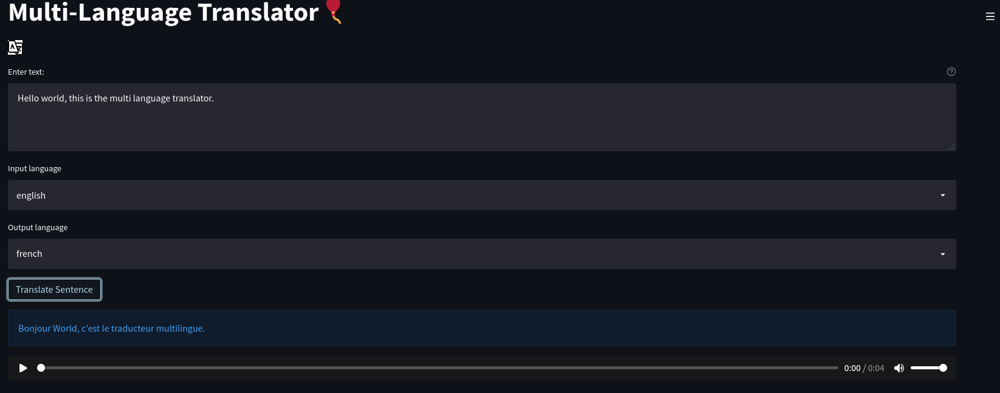
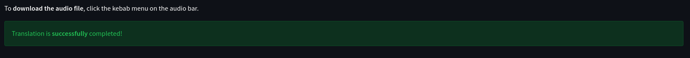

# NLP-Multi-language-translator
An app for translating from one language to another.Almost all world languages are available.

## Features.
1. Translates to any language.
2. The Web App also generates an audio file of the translation.
3. And lets you download the audio file.

web app: https://share.streamlit.io/group4day2019/nlp-multi-language-translator/main/main.py

## screenshots.

